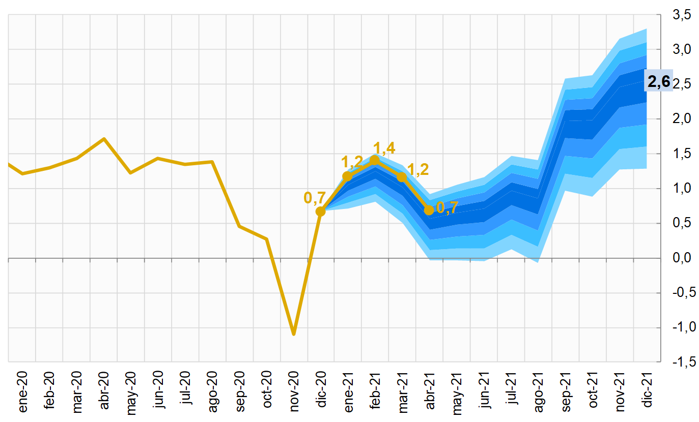

```{r setup, include=FALSE}
library(flexdashboard)
```

# Anual

Column {data-width=350}
-----------------------------------------------------------------------
### Abril-2021, Anual

```{r}
valueBox("0,68%", color="#deaa00", icon = "fa-caret-down")
```

### Anual

```{r}
chartAA
```

### Incidencias por división 

```{r}
chartDivDiv
```


Column {data-width=300}
-----------------------------------------------------------------------

### Artículos con mayor incidencia positiva y negativa
```{r}
datatable(mytable,
  extensions = 'Buttons', options = list(
    dom = 'Bfrtip',
    buttons = c('copy', 'excel', 'pdf')
  )
) %>%
  formatRound(columns=c('Variación (%)', 'Incidencia (pp)'), digits=3)
```

### Resumen

<p style="font-family: times, serif; font-size:18pt; font-style:italic">
En abril se registró una variación mensual negativa de -0,06%, con este resultado, la inflación acumulada y la interanual disminuyeron hasta 0,45% y 0,68%, respectivamente.
</p>

<p style="font-family: times, serif; font-size:18pt; font-style:italic">
El impacto de la caída de precios de la mayor parte de los bienes y servicios (siete divisiones registran variaciones negativas) se vio parcialmente mitigado por el alza de los precios de la carne de pollo y de res (0,13pp).
</p>

<p style="font-family: times, serif; font-size:18pt; font-style:italic">
Los indicadores de tendencia también presentaron una desaceleración en abril. El IPC-Núcleo registró su tasa más baja desde 2001.
</p>

Column {data-width=350}
-----------------------------------------------------------------------
### Indicadores de tendencia inflacionaria

```{r}
chartDD
```

### Descomposición de la inflación

```{r}
chartNuc1
```


# Mensual

Column {data-width=350}
-----------------------------------------------------------------------
### Abril-2021, Mensual

```{r}
valueBox("-0,06%", color="#deaa00", icon = "fa-caret-up")
```


### Mensual

```{r}
chartBBm
```


### Incidencias por división

```{r}
chartDivDiv_m
```


Column {data-width=300}
-----------------------------------------------------------------------

### Artículos con mayor incidencia positiva y negativa
```{r}
datatable(mytable_m,
  extensions = 'Buttons', options = list(
    dom = 'Bfrtip',
    buttons = c('copy', 'excel', 'pdf')
  )
) %>%
  formatRound(columns=c('Variación (%)', 'Incidencia (pp)'), digits=3)
```

### Resumen

<p style="font-family: times, serif; font-size:18pt; font-style:italic">
En abril se registró una variación mensual negativa de -0,06%, con este resultado, la inflación acumulada y la interanual disminuyeron hasta 0,45% y 0,68%, respectivamente.
</p>

<p style="font-family: times, serif; font-size:18pt; font-style:italic">
El impacto de la caída de precios de la mayor parte de los bienes y servicios (siete divisiones registran variaciones negativas) se vio parcialmente mitigado por el alza de los precios de la carne de pollo y de res (0,13pp).
</p>

<p style="font-family: times, serif; font-size:18pt; font-style:italic">
Los indicadores de tendencia también presentaron una desaceleración en abril. El IPC-Núcleo registró su tasa más baja desde 2001.
</p>


Column {data-width=350}
-----------------------------------------------------------------------
### Indicadores de tendencia inflacionaria

```{r}
chartDDD1
```

### Descomposición de la inflación

```{r}
chartNuc22
```


# Acumulado

Column {data-width=350}
-----------------------------------------------------------------------
### Abril-2021, Acumulada

```{r}
valueBox("0,45%", color="#deaa00", icon = "fa-caret-down")
```


### Acumulado

```{r}
chartCC
```

### Incidencias por división

```{r}
chartDivDiv_acum
```


Column {data-width=300}
-----------------------------------------------------------------------

### Artículos con mayor incidencia positiva y negativa
```{r}
datatable(mytable_acum,
  extensions = 'Buttons', options = list(
    dom = 'Bfrtip',
    buttons = c('copy', 'excel', 'pdf')
  )
) %>%
  formatRound(columns=c('Variación (%)', 'Incidencia (pp)'), digits=3)
```


### Resumen

<p style="font-family: times, serif; font-size:18pt; font-style:italic">
En abril se registró una variación mensual negativa de -0,06%, con este resultado, la inflación acumulada y la interanual disminuyeron hasta 0,45% y 0,68%, respectivamente.
</p>

<p style="font-family: times, serif; font-size:18pt; font-style:italic">
El impacto de la caída de precios de la mayor parte de los bienes y servicios (siete divisiones registran variaciones negativas) se vio parcialmente mitigado por el alza de los precios de la carne de pollo y de res (0,13pp).
</p>

<p style="font-family: times, serif; font-size:18pt; font-style:italic">
Los indicadores de tendencia también presentaron una desaceleración en abril. El IPC-Núcleo registró su tasa más baja desde 2001.
</p>

Column {data-width=350}
-----------------------------------------------------------------------
### Indicadores de tendencia inflacionaria

```{r}
chartEEE1
```

### Descomposición de la inflación

```{r}
chartNuc33
```


# Indicadores externos

Column {data-width=500, .tabset}
-----------------------------------------------------------------------
###Inflación externa relevante - anual
```{r}
chartIPE1
```

###Mensual
```{r}
chartIPE1m
```

###Acumulada
```{r}
chartIPE1acum
```


Column {data-width=500, .tabset}
-----------------------------------------------------------------------
###Inflación importada - anual
```{r}
chartIMP1
```

###Mensual
```{r}
chartIMP1m
```

###Acumulada
```{r}
chartIMP1acum
```


# Proyecciones y expectativas

Column {data-width=500, .tabset}
-----------------------------------------------------------------------
###Proyección de corto plazo
```{r picture, echo=F, fig.cap = "Inflación interanual proyectada", out.width='80%'}

```

###Expectativas de inflación
```{r}
chartEXP1
```


